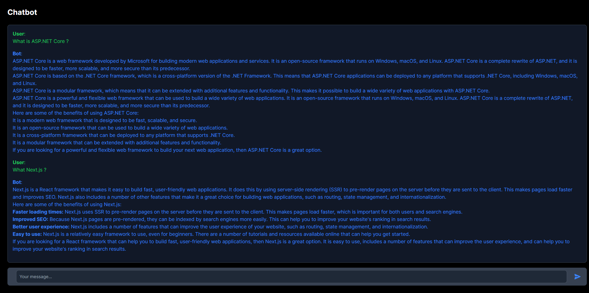

# Chat Bot Application

This is a full stack application built with ASP.NET Core 8 and Next.js with TypeScript and TailwindCSS. The application is a chat bot powered by PaLM 2.



## Getting Started

These instructions will get you a copy of the project up and running on your local machine for development and testing purposes.

### Prerequisites

- .NET 8.0 SDK
- Node.js

### Installing

1. Clone the repository
```bash
  git clone https://github.com/RianNegreiros/DotNetChatBot.git
```

2. Setup the server configuration
```bash
  cd src/API
  cp appsettings.json.example appsettings.json
  cp appsettings.json.example appsettings.Development.json
```
Then set the `LANGUAGE_MODEL_API_KEY` with your PaLM API key

3. Setup the client configuration
```bash
  cd src/client
  cp .env.example .env
```

4. Restore the .NET packages and run the ASP.NET API
```bash
  dotnet restore
  dotnet run --project src/API
```

5. Navigate to the `client` directory, install the dependencies and run the client
```bash
  cd src/client
  npm install
  npm run dev
```

The application should now be running at `http://localhost:3000`.

## Built With
 - [ASP.NET Core 8](https://learn.microsoft.com/en-us/dotnet/core/whats-new/dotnet-8?source=recommendations) - The server framework
 - [Next.js](https://nextjs.org/docs) - The client framework
 - [TypeScript](https://www.typescriptlang.org/) - The language for building the client
 - [TailwindCSS](https://tailwindcss.com) - The utility-first CSS framework used for styling
 - [PaLM API](https://developers.googleblog.com/2023/03/announcing-palm-api-and-makersuite.html) - The PaLM API is a simple entry point for Google’s large language models

## License

This project is licensed under the MIT License - see the [LICENSE](LICENSE) file for details
